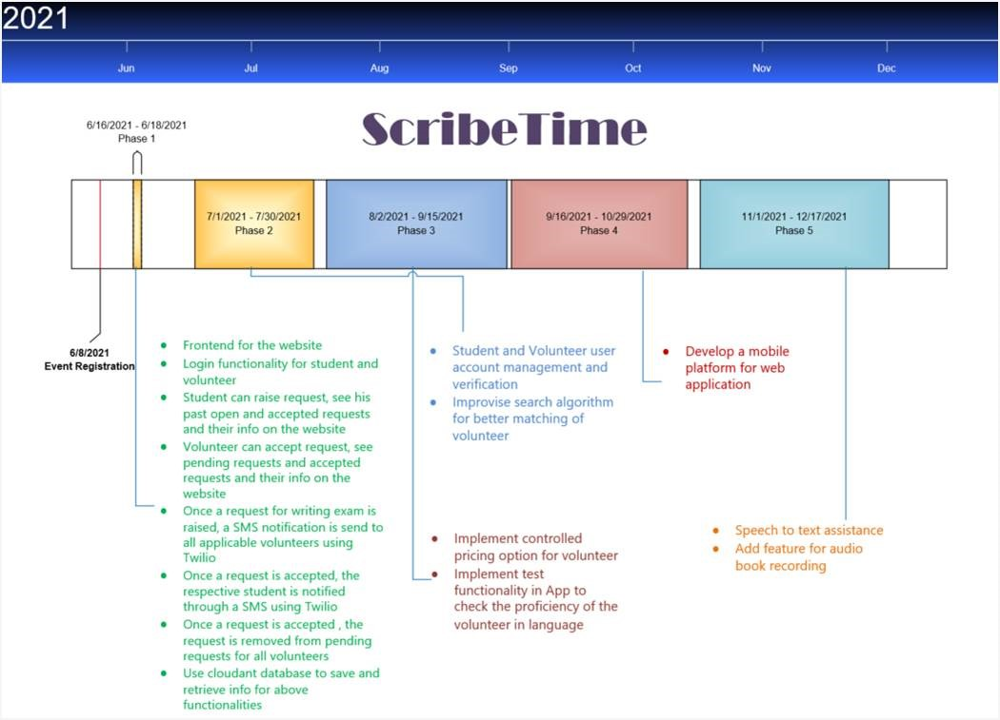

# ScribeTime
 ### The Problem

In past visually impaired students or students with special needs were placed in different institutions or programs and not in regular schools or colleges. However, with the advent of technology and regulations by the government, more students are coming up and getting themselves enrolled in regular institutions. But this in turn has created another challenge for these students. These students not only has to stress about their exams, but also has to spend considerable amount of time and money to find a scribe to help them to write their exam. Providing an education environment that is hassle free and unbaised for these students has become a basic necessity. 

### Solution 
We have various people who likes to volunteer for different causes. All we need to do is to bring the people who likes to help and the people who needs help under one umbrella. This will save lot of time and efforts for both the students as well as for the volunteers.

### The Idea

The aim of this project is to bring the voluteers willing to help and students who needs help under one community. Our application, ScribeTime, registers students and volunteers and maintain their data. Whenever a students needs a scribe, the application uses an algorithm and finds set of best matching volunteers for the student. The voluteers are then sent a request to accept, any volunteer who is willing to help and meeting the availability needs, can accept the request and will be connected to the student. This can also be used by the students with temporary problems, like fracture, to find a scribe for writting their exams.
Instead of making thousands of calls to find a scribe, ScribeTime lets you connect to a best suitable scribe within a few clicks.

### Registration & Verification

Both the volunteers and students (or someone or some NGO on their behalf) can register on ScribeTime. The application should be intelligent enough to verify that student is a genuine case, using disabilty certificate provided by the student . The volunteers need to enter the languages they can write exam in. The volunteer should also be able to speak in those languages. For volunteer , his GOV Id and educational qualification verification should be done through application. The application should also be able to evaluate the proficiency of the volunteer in the langauages registered  during registration. Once registration is complete, users can login into their accounts on the website.

### Request Process Flow

1. Student can raise request giving the exam details like venue, date ,time , language required etc. 
2. The application will try to find the best suitable candidates who can write the exam requested by the student. The search algorithm for finding best suitable candidates should take into consideration the language required in the exam (whether the volunteer can speak and write in that language), the distance of the exam venue from the volunteer's current location (requests will be sent to only those volunteers within a threshold distance) and the educational qualification of the volunteer.The application should also take into account the past requests and help to provide a personalised search for the Students. The application will then send a SMS notifcation to all such applicable volunteers. 
3. The volunteers can visit the website and accept or reject the request, according to their availability. 
4. Volunteer can  see all  pending requests and accepted requests and their information on the application. 
5. Whenever a request is accepted, a SMS notification is sent to the respective student notifying that his request got accepted. 
6. Student can visit the volunteer's profile to check his basic information and contact the volunteer if needed.
7. Student can see his past open and accepted requests and their info on the application. 
8. The application will help the student in finding a volunteer. After that its the responsibilty of the student (or the person or organisation registering on his/her behalf) to take the required permissions from the exam organising committee.

## Architecture

1. Student and volunteer can interact with the flask web application to raise request and accept/ reject requests respectively.
2. The web application and search algorithm fetches data from cloudant database to find the best suitable volunteer for the request raised by the student.
3. Once suitable volunteers are found, the web application uses Twilio to notify them.
4. Once a request is accepted , the web application uses Twilio to notify the student about the acceptance of his/her request.

## Road Map

## Tools Used
1. Flask
2. Python
3. IBM's Cloudant
4. IBM's Twilio
5. HTML
6. CSS

## Conclusion
This application saves the time and efforts a student spends in searching for a scribe. It also brings the people together, and tries to provide a hassle free education environment for the needy students. 

